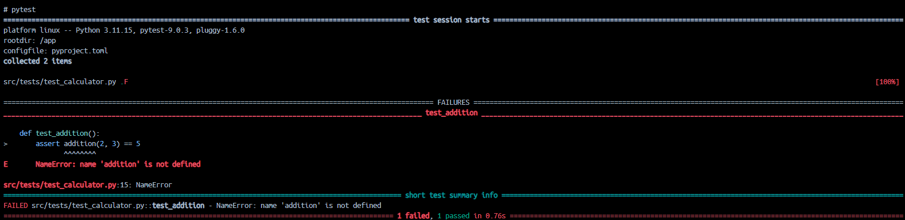

# Rapport

## Question 1

> Si l'un des tests échoue à cause d'un bug, comment pytest signale-t-il l'erreur et aide-t-il à la localiser ? Rédigez un test qui provoque volontairement une erreur, puis montrez la sortie du terminal obtenue.

Pytest indique l’erreur dans un rapport détaillé dans la console. Si le test échoue, le framework ajoute une section `FAILURES` indiquant précisément la fonction de test qui a échoué, en soulignant le bout de code problématique avec une flèche (`>`) pour montrer la ligne exacte qui a causé l’échec, et en indiquant l’erreur Python spécifique (ici `NameError` parce que la fonction n’est pas importée ou appelée correctement) avec le chemin du fichier et le numéro de la ligne.

### Test provoquant volontairement une erreur

```python
def test_addition():
    assert addition(2, 3) == 5
```

### Sortie du terminal obtenue



## Question 2

> Que fait GitHub pendant les étapes de « setup » et « checkout » ? Veuillez inclure la sortie du terminal GitHub CI dans votre réponse.

### L'étape de « setup » (Set up job)

Le système crée l’environnement d’exécution (le runner virtuel). Il configure le système d’exploitation cible (ex: Ubuntu 24.04), donne les permissions requises au token d’authentification (`GITHUB_TOKEN`) et télécharge les actions nécessaires au bon déroulement du workflow (comme `actions/checkout@v3` et `actions/setup-python@v4`).

<div style="page-break-after: always;"></div>

#### Sortie du terminal GitHub CI


### L'étape de « checkout » (Checkout dépôt)

Le runner communique avec Git pour récupérer le code source du projet. Il crée un dépôt Git local dans l'espace de travail du runner, configure l'authentification de manière sécurisée, récupère (fetch) les fichiers depuis la branche distante, et fait un checkout (bascule sur la bonne branche, ex: `main`). Cela permet aux étapes suivantes (comme l’installation des dépendances et l’exécution de `pytest`) de disposer des fichiers du projet.

#### Sortie du terminal GitHub CI


<div style="page-break-after: always;"></div>

## Question 3

> Quel type d'informations pouvez-vous obtenir via la commande `top` ? Veuillez donner quelques exemples. Veuillez inclure la sortie du terminal dans votre réponse.

La commande top est un utilitaire de gestion de tâches qui permet de surveiller l'utilisation en temps réel des ressources du système. Elle donne plusieurs types d’informations importantes pour évaluer l’état de santé d’une machine :

- **Temps de disponibilité et charge (uptime / load average) :** Informe sur la durée d'allumage de la machine et affiche une moyenne de la charge de la machine.

- **Résumé des tâches (Tasks) :** Affiche le nombre total de processus et le nombre de processus en cours, en veille et en terminés.

- **Utilisation du processeur (%Cpu(s)) :** Montre le pourcentage de temps CPU inactif (id), utilisé par des processus système (sy), ou par l'utilisateur (us).

- **Utilisation de la mémoire (MiB Mem / MiB Swap) :** Indique la quantité totale, libre, utilisée et mise en cache de mémoire vive et virtuelle.

- **Détails des processus :** Donne une liste dynamique des processus en cours d’exécution avec leur identifiant (PID), l’utilisateur propriétaire (USER), et leur consommation individuelle en processeur (%CPU) et en mémoire (%MEM).

<div style="page-break-after: always;"></div>

### Sortie du terminal

```bash
root@vm-jerome-log430:~/log430-labo0# top
top - 20:30:20 up 31 min,  1 user,  load average: 0.00, 0.00, 0.00
Tasks:  78 total,   1 running,  77 sleeping,   0 stopped,   0 zombie
%Cpu(s):  0.0 us,  0.3 sy,  0.0 ni, 99.7 id,  0.0 wa,  0.0 hi,  0.0 si,  0.0 st
MiB Mem :   3587.0 total,   2624.2 free,    140.1 used,    822.6 buff/cache
MiB Swap:      0.0 total,      0.0 free,      0.0 used.   3380.4 avail Mem

    PID USER      PR  NI    VIRT    RES    SHR S  %CPU  %MEM     TIME+ COMMAND
   1672 root      20   0   17204  11136   8756 S   0.3   0.3   0:00.08 sshd
      1 root      20   0  101776  12796   8344 S   0.0   0.3   0:04.82 systemd
      2 root      20   0       0      0      0 S   0.0   0.0   0:00.00 kthreadd
      3 root       0 -20       0      0      0 I   0.0   0.0   0:00.00 rcu_gp
      4 root       0 -20       0      0      0 I   0.0   0.0   0:00.00 rcu_par_gp
      5 root       0 -20       0      0      0 I   0.0   0.0   0:00.00 slub_flushwq
      6 root       0 -20       0      0      0 I   0.0   0.0   0:00.00 netns
      7 root      20   0       0      0      0 I   0.0   0.0   0:00.00 kworker/0:0-virtio_vsock
      8 root       0 -20       0      0      0 I   0.0   0.0   0:00.00 kworker/0:0H-events_highpri
     10 root       0 -20       0      0      0 I   0.0   0.0   0:00.00 mm_percpu_wq
     11 root      20   0       0      0      0 S   0.0   0.0   0:00.00 rcu_tasks_trace
     12 root      20   0       0      0      0 S   0.0   0.0   0:00.11 ksoftirqd/0
     13 root      20   0       0      0      0 I   0.0   0.0   0:00.69 rcu_sched
     14 root      rt   0       0      0      0 S   0.0   0.0   0:00.00 migration/0
     15 root      20   0       0      0      0 S   0.0   0.0   0:00.00 cpuhp/0
     16 root      20   0       0      0      0 S   0.0   0.0   0:00.00 kdevtmpfs
     17 root       0 -20       0      0      0 I   0.0   0.0   0:00.00 inet_frag_wq
     18 root      20   0       0      0      0 S   0.0   0.0   0:00.00 kauditd
     19 root      20   0       0      0      0 S   0.0   0.0   0:00.00 oom_reaper
     20 root       0 -20       0      0      0 I   0.0   0.0   0:00.00 writeback
     42 root       0 -20       0      0      0 I   0.0   0.0   0:00.00 kblockd
     43 root       0 -20       0      0      0 I   0.0   0.0   0:00.00 blkcg_punt_bio
     45 root       0 -20       0      0      0 I   0.0   0.0   0:00.00 tpm_dev_wq                                       
```