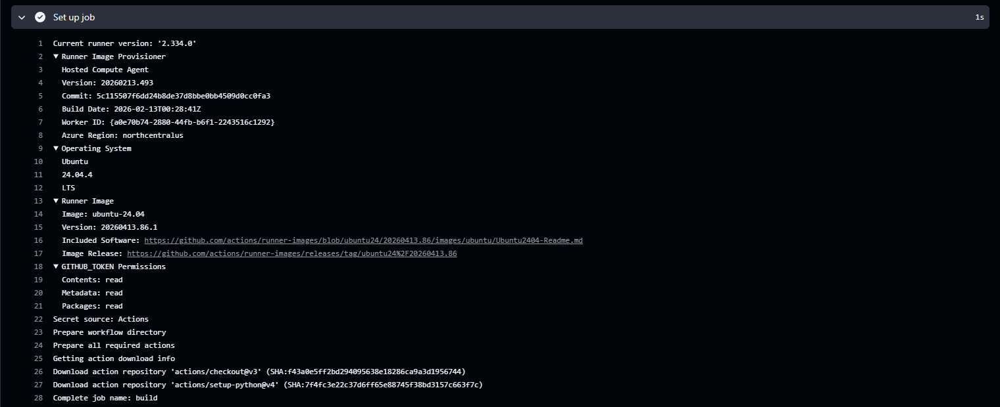
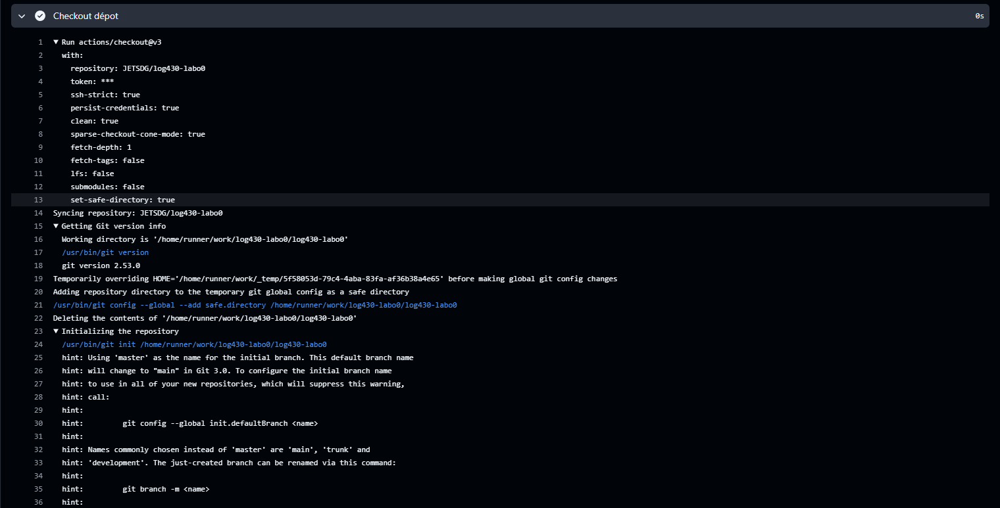
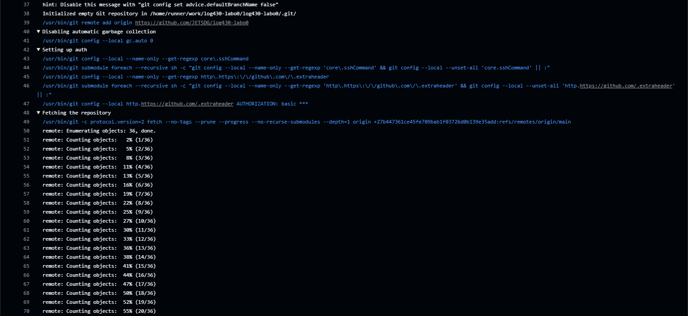
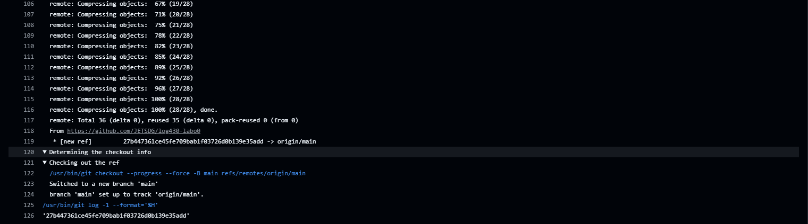

# Rapport

## Question 1

> Si l'un des tests échoue à cause d'un bug, comment pytest signale-t-il l'erreur et aide-t-il à la localiser ? Rédigez un test qui provoque volontairement une erreur, puis montrez la sortie du terminal obtenue.

```bash
# pytest
===================================================================================================== test session starts ======================================================================================================
platform linux -- Python 3.11.15, pytest-9.0.3, pluggy-1.6.0
rootdir: /app
configfile: pyproject.toml
collected 2 items                                                                                                                                                                                                              

src/tests/test_calculator.py .F                                                                                                                                                                                          [100%]

=========================================================================================================== FAILURES ===========================================================================================================
________________________________________________________________________________________________________ test_addition _________________________________________________________________________________________________________

    def test_addition():
>       assert addition(2, 3) == 5
               ^^^^^^^^
E       NameError: name 'addition' is not defined

src/tests/test_calculator.py:15: NameError
=================================================================================================== short test summary info ====================================================================================================
FAILED src/tests/test_calculator.py::test_addition - NameError: name 'addition' is not defined
================================================================================================= 1 failed, 1 passed in 0.46s ==================================================================================================
```

## Question 2

> Que fait GitHub pendant les étapes de « setup » et « checkout » ? Veuillez inclure la sortie du terminal GitHub CI dans votre réponse.

### setup



### checkout








## Question 3

```bash
root@vm-jerome-log430:~/log430-labo0# top
top - 20:30:20 up 31 min,  1 user,  load average: 0.00, 0.00, 0.00
Tasks:  78 total,   1 running,  77 sleeping,   0 stopped,   0 zombie
%Cpu(s):  0.0 us,  0.3 sy,  0.0 ni, 99.7 id,  0.0 wa,  0.0 hi,  0.0 si,  0.0 st
MiB Mem :   3587.0 total,   2624.2 free,    140.1 used,    822.6 buff/cache
MiB Swap:      0.0 total,      0.0 free,      0.0 used.   3380.4 avail Mem

    PID USER      PR  NI    VIRT    RES    SHR S  %CPU  %MEM     TIME+ COMMAND
   1672 root      20   0   17204  11136   8756 S   0.3   0.3   0:00.08 sshd
      1 root      20   0  101776  12796   8344 S   0.0   0.3   0:04.82 systemd
      2 root      20   0       0      0      0 S   0.0   0.0   0:00.00 kthreadd
      3 root       0 -20       0      0      0 I   0.0   0.0   0:00.00 rcu_gp
      4 root       0 -20       0      0      0 I   0.0   0.0   0:00.00 rcu_par_gp
      5 root       0 -20       0      0      0 I   0.0   0.0   0:00.00 slub_flushwq
      6 root       0 -20       0      0      0 I   0.0   0.0   0:00.00 netns
      7 root      20   0       0      0      0 I   0.0   0.0   0:00.00 kworker/0:0-virtio_vsock
      8 root       0 -20       0      0      0 I   0.0   0.0   0:00.00 kworker/0:0H-events_highpri
     10 root       0 -20       0      0      0 I   0.0   0.0   0:00.00 mm_percpu_wq
     11 root      20   0       0      0      0 S   0.0   0.0   0:00.00 rcu_tasks_trace
     12 root      20   0       0      0      0 S   0.0   0.0   0:00.11 ksoftirqd/0
     13 root      20   0       0      0      0 I   0.0   0.0   0:00.69 rcu_sched
     14 root      rt   0       0      0      0 S   0.0   0.0   0:00.00 migration/0
     15 root      20   0       0      0      0 S   0.0   0.0   0:00.00 cpuhp/0
     16 root      20   0       0      0      0 S   0.0   0.0   0:00.00 kdevtmpfs
     17 root       0 -20       0      0      0 I   0.0   0.0   0:00.00 inet_frag_wq
     18 root      20   0       0      0      0 S   0.0   0.0   0:00.00 kauditd
     19 root      20   0       0      0      0 S   0.0   0.0   0:00.00 oom_reaper
     20 root       0 -20       0      0      0 I   0.0   0.0   0:00.00 writeback
     42 root       0 -20       0      0      0 I   0.0   0.0   0:00.00 kblockd
     43 root       0 -20       0      0      0 I   0.0   0.0   0:00.00 blkcg_punt_bio
     45 root       0 -20       0      0      0 I   0.0   0.0   0:00.00 tpm_dev_wq                                       
```